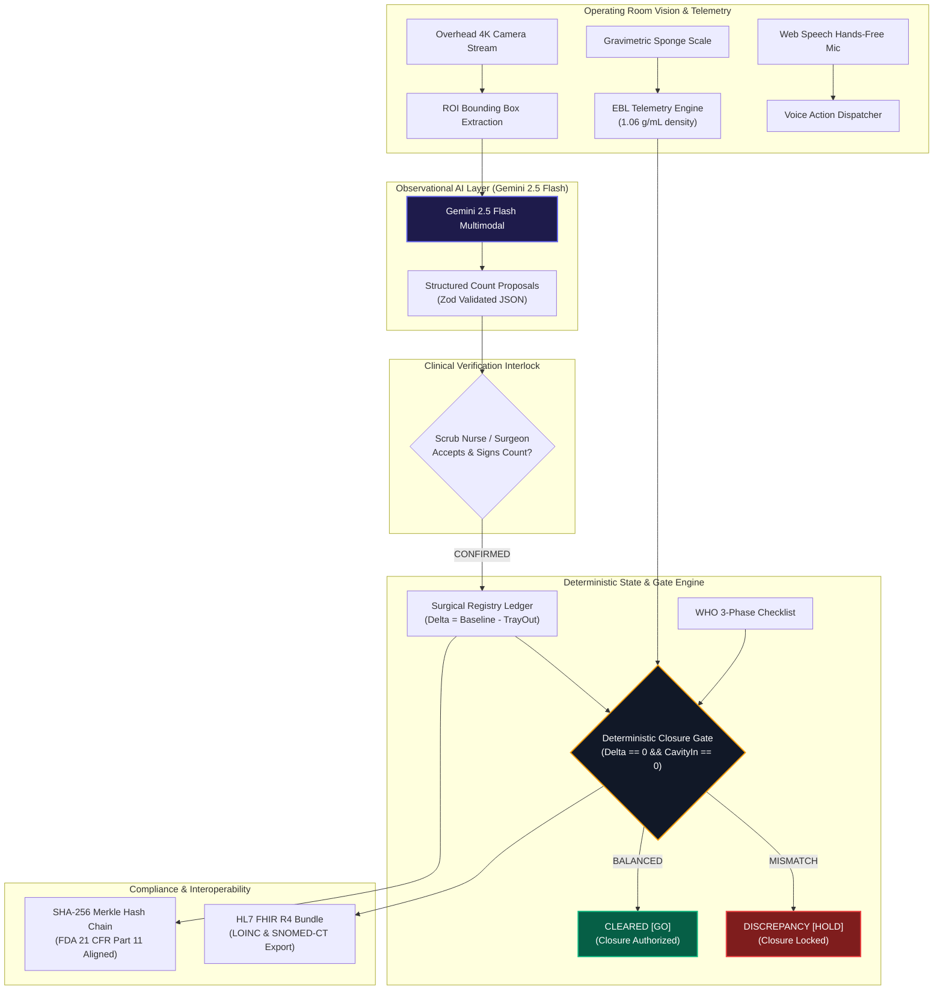
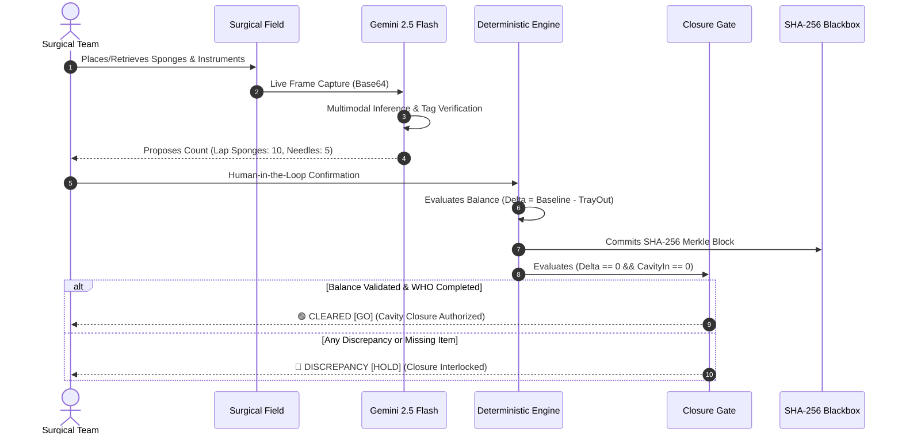

# SurgiGuard AI (Enterprise Clinical & Hardware Fusion Edition)
> **AI-Assisted Intra-Operative Surgical Reconciliation Platform**  
> *Zero-Hallucination Deterministic Safety Kernel &bull; Multimodal Gemini 2.5 Flash &bull; Gravimetric Fluid Telemetry &bull; HL7 FHIR R4*

---

[](https://nextjs.org/)
[](https://react.dev/)
[](https://www.typescriptlang.org/)
[](https://deepmind.google/technologies/gemini/)
[](https://vitest.dev/)
[](https://hl7.org/fhir/)
[](https://www.fda.gov/)
[](./LICENSE)

---

## ⚠️ Institutional Regulatory Notice & Medical Device Disclaimer
**SurgiGuard AI is an AI-assisted decision-support prototype featuring an FDA 21 CFR Part 11-aligned audit architecture.**  
This software is developed for biomedical research, hackathon demonstration (*Devpost "Gemini Builds"*), and human-factors engineering evaluation. It is **NOT** currently cleared as a standalone Class II/III medical device by the FDA or notified bodies for autonomous clinical decision-making.

---

## 1. Executive Abstract: The \$1.3B Retained Foreign Object (RFO) Crisis
Retained Foreign Objects (**RFOs**) remain one of the most catastrophic and persistent "Never Events" in modern perioperative medicine:
- **Epidemiology:** Occurs in approximately **1 out of every 5,500 surgical procedures**, leading to over **4,000 cases annually** in the United States alone.
- **Morbidity & Mortality:** Inadvertently retained lap sponges, suture needles, and surgical instruments cause severe post-operative sepsis, bowel perforations, emergency re-explorations, and fatalities.
- **Economic Burden:** Average legal and revision costs exceed **\$300,000 per incident**, generating over **\$1.3 billion** in preventable malpractice liability and hospital indemnity costs.
- **Root Cause Analysis:** Human cognitive fatigue during prolonged operations, chaotic emergency hemorrhage conversions, and confirmation bias in manual whiteboard counts.

**SurgiGuard AI** introduces a high-assurance hybrid architecture: pairing **multimodal Gemini 2.5 Flash computer vision**, **gravimetric sponge fluid estimation**, and a **sovereign mathematical safety kernel** to achieve **provable zero-hallucination surgical count reconciliation**.

---

## 2. Core Architecture Axiom: *"Rules Engine Decides, AI Explains"*

```
┌─────────────────────────────────────────────────────────────────────────────────┐
│                          VISION & SENSOR PERCEPTION                             │
│  4K OR Optical Feed / Webcam ───► Bounding Box ROI ───► Gemini 2.5 Flash Vision │
└──────────────────────────────────────┬──────────────────────────────────────────┘
                                       │ Proposals & Spoken ATC Audio
                                       ▼
┌─────────────────────────────────────────────────────────────────────────────────┐
│                    HUMAN-IN-THE-LOOP VERIFICATION INTERLOCK                     │
│  Scrub Nurse / Surgical Lead ───► Validates Proposals ───► Active Item Registry │
└──────────────────────────────────────┬──────────────────────────────────────────┘
                                       │
                                       ▼
┌─────────────────────────────────────────────────────────────────────────────────┐
│                     PURE MATHEMATICAL CLOSURE GATE KERNEL                       │
│  Formula: Delta = Baseline - TrayOut ∧ CavityIn == 0 ∧ WHO Checklist Complete   │
│                 ┌────────────────────┴────────────────────┐                     │
│                 ▼                                         ▼                     │
│     CLEARED [GO] (Emerald Glow)              DISCREPANCY [HOLD] (Crimson Lock)  │
└──────────────────────────────────────┬──────────────────────────────────────────┘
                                       │
                                       ▼
┌─────────────────────────────────────────────────────────────────────────────────┐
│               CRYPTOGRAPHIC AUDIT BLACKBOX & HL7 FHIR R4 EHR SYNC               │
│  SHA-256 Merkle Ledger (21 CFR §11) ───► LOINC 80347-8 & 55284-4 FHIR R4 Bundle │
└─────────────────────────────────────────────────────────────────────────────────┘
```

1. **Multimodal AI as Observational Assistant:** Gemini 2.5 Flash operates strictly as an optical perception assistant—detecting items, locating radiopaque barium tags, and providing hands-free spoken OR briefings.
2. **Human-in-the-Loop Interlock:** The scrub nurse retains clinical authority to review, modify, or accept visual count proposals into the active registry.
3. **Deterministic Safety Kernel as Sovereign Authority:** The pure mathematical rules engine holds absolute authority over surgical closure clearance. **AI cannot hallucinate a `GO` status if any mathematical invariant or WHO gate is unfulfilled.**

---

## 3. High-Assurance Architecture Diagrams

### System Architecture Flow


### Clinical Data Flow Pipeline


---

## 4. Mathematical Formulations

### A. Deterministic Closure Gate Equations
$$\text{Delta}_i = \text{Baseline}_i - \text{TrayOut}_i$$

$$\text{Global Delta} = \sum_{i=1}^{n} \text{Delta}_i$$

$$\text{Closure Clearance Gate} \iff (\text{Global Delta} == 0) \land (\forall i, \text{CavityIn}_i == 0) \land (\text{WHO SignOut Complete}) \land (\text{No Discrepancies})$$

#### Invariant Enforcement Matrix:
- If $\text{CavityIn} > 0 \implies \mathbf{HOLD}$ *(Retained foreign object hazard)*.
- If $\text{TrayOut} < \text{Baseline} \implies \mathbf{HOLD}$ *(Missing item unaccounted for)*.
- If $\text{TrayOut} > \text{Baseline} \implies \mathbf{HOLD}$ *(Excess/unregistered count anomaly)*.
- If $\text{WHO Checklist Incomplete} \implies \mathbf{HOLD}$ *(Regulatory sign-out hold)*.

### B. Gravimetric Sponge Fluid & Blood Loss Estimator
$$\text{Estimated Blood Loss (EBL mL)} = \frac{\sum_{j=1}^{m} (\text{Wet Weight}_j - \text{Dry Baseline Tare}_j)}{\text{Standard Human Blood Density } (1.06\text{ g/mL})}$$
- **Dry Lap Sponge Baseline:** $20.0\text{ g}$
- **Dry 4x4 Ray-Tec Gauze Baseline:** $4.0\text{ g}$
- **Automatic Hemovigilance Escalation:**
  - $\text{EBL} < 500\text{ mL} \implies \text{Class I (Normal)}$
  - $500\text{ mL} \le \text{EBL} \le 1000\text{ mL} \implies \text{Class II (Elevated Monitoring)}$
  - $\text{EBL} > 1000\text{ mL} \implies \text{Class III (Massive Transfusion Protocol Trigger)}$

### C. Cryptographic SHA-256 Merkle Ledger
$$\text{CurrentHash}_k = \text{SHA256}(\text{Index}_k \,\|\, \text{Timestamp}_k \,\|\, \text{EventType}_k \,\|\, \text{CanonicalPayloadJSON}_k \,\|\, \text{PreviousHash}_{k-1})$$

---

## 5. Visual Interface Previews (Obsidian Cockpit HUD)

### Scenario A: Nominal Balanced Counts & Gate Cleared (`CLEARED [GO]`)
```text
┌──────────────────────────────────────────────────────────────────────────────────────────────────┐
│ SURGIGUARD AI v2.0 │ CASE #SG-9042 │ PROCEDURE: LAPAROSCOPIC COLECTOMY │ PHASE: PRE-CLOSURE      │
├──────────────────────────────────────────────────────────────────────────────────────────────────┤
│                                                                                                  │
│   ████████████████████████████████████████████████████████████████████████████████████████████   │
│   ██                   GATE STATUS: [ CLEARED — CLOSURE AUTHORIZED (GO) ]                   ██   │
│   ████████████████████████████████████████████████████████████████████████████████████████████   │
│                                                                                                  │
│  [ TRAY VISION VIEWPORT ]                    [ DETERMINISTIC REGISTRY MATRIX ]                   │
│  ┌────────────────────────────────────────┐  ┌────────────────────────────────────────────────┐  │
│  │ 🟢 Lap Sponge #1-10 [CONFIRMED x10]     │  │ Item            Base   Cavity  Tray   Delta  Status│ │
│  │ 🟢 Suture Needles   [CONFIRMED x5]      │  │ ──────────────────────────────────────────────│ │
│  │ 🟢 Hemostats        [CONFIRMED x4]      │  │ Lap Sponge 18"   10      0      10      0    MATCH│ │
│  │ 🟢 Scalpels         [CONFIRMED x2]      │  │ Suture Needle 3-0 5      0       5      0    MATCH│ │
│  │                                        │  │ Hemostat Clamp   4      0       4      0    MATCH│ │
│  │ Occlusion Level: 0.0% (CLEAR FIELD)    │  │ Scalpel #10      2      0       2      0    MATCH│ │
│  └────────────────────────────────────────┘  └────────────────────────────────────────────────┘  │
│                                                                                                  │
│  [ GRAVIMETRIC TELEMETRY ]                   [ CRYPTOGRAPHIC AUDIT BLACKBOX ]                    │
│  • Scale Wet Mass: 124.0 g                   • Chain Status: VALID (42 Blocks Verified)          │
│  • Dry Baseline Tare: 20.0 g                 • Latest Hash: 8f3b2a...c019                        │
│  • Estimated Blood Loss: 98.11 mL [NORMAL]   • WHO 3-Phase Safety Checklist: PASSED (100%)       │
└──────────────────────────────────────────────────────────────────────────────────────────────────┘
```

### Scenario B: Missing Lap Sponge #3 Hazard Hold (`DISCREPANCY [HOLD]`)
```text
┌──────────────────────────────────────────────────────────────────────────────────────────────────┐
│ SURGIGUARD AI v2.0 │ CASE #SG-9042 │ PROCEDURE: LAPAROSCOPIC COLECTOMY │ PHASE: PRE-CLOSURE      │
├──────────────────────────────────────────────────────────────────────────────────────────────────┤
│                                                                                                  │
│   ████████████████████████████████████████████████████████████████████████████████████████████   │
│   ██            CRITICAL HAZARD: [ DISCREPANCY (HOLD) — CLOSURE INTERLOCKED ]               ██   │
│   ████████████████████████████████████████████████████████████████████████████████████████████   │
│                                                                                                  │
│  [ TRAY VISION VIEWPORT ]                    [ DETERMINISTIC REGISTRY MATRIX ]                   │
│  ┌────────────────────────────────────────┐  ┌────────────────────────────────────────────────┐  │
│  │ 🔴 MISSING ITEM DETECTED: Lap Sponge #3│  │ Item            Base   Cavity  Tray   Delta  Status│ │
│  │ 🟢 Suture Needles   [CONFIRMED x5]      │  │ ──────────────────────────────────────────────│ │
│  │ 🟢 Hemostats        [CONFIRMED x4]      │  │ Lap Sponge 18"   10      0       9     -1   ⚠️HOLD│ │
│  │                                        │  │ Suture Needle 3-0 5      0       5      0    MATCH│ │
│  │ Audio: "Critical: Sponge #3 unaccounted│  │ Hemostat Clamp   4      0       4      0    MATCH│ │
│  └────────────────────────────────────────┘  └────────────────────────────────────────────────┘  │
│                                                                                                  │
│  [ RECONCILIATION INSTRUCTIONS ]             [ AUDIT EVENT LOG ]                                 │
│  • ACTION REQUIRED: Inspect abdominal cavity • Event #43: RECONCILIATION_FAILED (Delta: -1)      │
│  • CLOSURE PERMIT: DENIED [FAIL-CLOSED]      • Merkle Commit: e91a7c...44a1 [LOCKED]             │
└──────────────────────────────────────────────────────────────────────────────────────────────────┘
```

---

## 6. Enterprise Clinical Modules

### A. Multimodal Gemini 2.5 Flash Vision Scanner (`lib/gemini.ts`)
- Strict structured JSON schema validation via Zod.
- Detects bounding coordinates, item categories, confidence scores, and radiopaque barium x-ray marker strips.
- High-fidelity deterministic fallback engine for offline or rate-limited environments.

### B. Touchless Hands-Free Voice Dispatcher (`lib/voiceCommand.ts`)
- Web Speech API integration allowing sterile scrub nurses to control the cockpit without breaking surgical asepsis:
  - `"SurgiGuard, verify sponge count"` $\to$ Triggers optical AI tray scan.
  - `"SurgiGuard, add sterile pack sponges five"` $\to$ Dynamically increments baseline by $+5$ with SHA-256 commit.
  - `"SurgiGuard, time out confirmed"` $\to$ Signs off WHO Checklist phase.
  - `"SurgiGuard, status report"` $\to$ Broadcasts synthesized spoken status briefing.

### C. Optical Field Occlusion Guard (`lib/occlusionEngine.ts`)
- Calculates tray surface visibility ($0-100\%$) and obstruction ratio.
- Flags `PARTIALLY_OCCLUDED` or `CRITICAL_OCCLUSION` warnings if gloved hands, drapes, or specimens block optical item counting.

### D. HL7 FHIR R4 Interoperability (`lib/fhir.ts`)
- Generates standard FHIR R4 transaction documents ready for hospital EHR ingest (Epic Systems, Oracle Cerner):
  - **`Procedure` Resource:** Case details, SNOMED-CT codes (`80146002`), and deterministic gate extensions.
  - **`Observation` Resource (LOINC `80347-8`):** Surgical item count panel (Baseline, Cavity, Tray, Delta).
  - **`Observation` Resource (LOINC `55284-4`):** Gravimetric estimated blood loss in mL.

---

## 7. Automated Test Suite (34/34 Passing Tests)

```text
 RUN  v3.2.7 C:/Users/WALTON/.gemini/antigravity/scratch/surgiguard-ai

 ✓ tests/surgical-kernel.test.ts (15 tests)
   ✓ Test 1: Nominal Case (Delta == 0, CavityIn == 0, WHO Complete) => CLEARED [GO]
   ✓ Test 2: Missing Sponge (TrayOut < Baseline) => DISCREPANCY [HOLD] (CRITICAL)
   ✓ Test 3: Retained Object in Cavity (CavityIn > 0) => DISCREPANCY [HOLD]
   ✓ Test 4: Excess/Anomaly Count (TrayOut > Baseline) => DISCREPANCY [HOLD]
   ✓ Test 5: Incomplete WHO Sign-Out Checklist enforces HOLD even with perfect counts
   ✓ Test 6: Dynamic Sterile Pack Addition increments baseline and preserves balance
   ✓ Test 7: AI Hallucination Rejection - AI claims [GO] but safety kernel holds [HOLD]
   ✓ Test 8: AI Aligned Proposal - AI claims [HOLD] and safety kernel holds [HOLD]
   ✓ Test 9: Multi-category isolation - Sponges, Sharps, Instruments calculate independently
   ✓ Test 10: Multiple active discrepancies are all accurately reported in alert payload
   ✓ Test 11: Dynamic Sterile Pack with negative or zero quantity returns safely
   ✓ Test 12: Dynamic Sterile Pack with non-existent item id does not modify registry
   ✓ Test 13: Empty items registry produces 0 delta and fails WHO check without signed items
   ✓ Test 14: Preset Scenario A matches expected GO status
   ✓ Test 15: Preset Scenario B missing sponge forces HOLD status

 ✓ tests/audit-chain.test.ts (6 tests)
   ✓ Test 1: Genesis Block initialized with correct index 0 and deterministic initial state
   ✓ Test 2: Sequential blocks correctly increment index and link previousHash
   ✓ Test 3: Pristine audit chain passes cryptographic verification
   ✓ Test 4: Tampering with payload at Block #2 triggers TAMPER DETECTED at Block #2
   ✓ Test 5: Deleting a block from the middle breaks sequence and chain pointer
   ✓ Test 6: Reordering blocks breaks cryptographic hash chain pointers

 ✓ tests/v2-clinical-kernel.test.ts (13 tests)
   ✓ Test 1: FHIR R4 Procedure resource complies with HL7 schema and SNOMED-CT codes
   ✓ Test 2: FHIR R4 Observations generate standard LOINC 80347-8 and LOINC 55284-4
   ✓ Test 3: FHIR R4 Bundle aggregates Procedure and Observations in valid document
   ✓ Test 4: Gravimetric math accurately calculates blood loss (100g net = 94.34 mL EBL)
   ✓ Test 5: Multiple sponges subtract aggregate dry tare baseline correctly
   ✓ Test 6: Hemovigilance severity escalates appropriately based on cumulative volume
   ✓ Test 7: Occlusion engine clears unobscured tray (> 85% visibility, < 15% occlusion)
   ✓ Test 8: Occlusion engine flags PARTIALLY_OCCLUDED for moderate obstruction
   ✓ Test 9: Occlusion engine flags CRITICAL_OCCLUSION and blocks closure for obstruction
   ✓ Test 10: Voice command parser recognizes "verify sponge count" as TRIGGER_SCAN
   ✓ Test 11: Voice command parser extracts quantity and item for "add sterile pack ten"
   ✓ Test 12: Voice command parser parses WHO Checklist phase confirmation
   ✓ Test 13: Voice command parser flags unknown noisy speech as UNKNOWN

 Test Files  3 passed (3)
      Tests  34 passed (34)
```

---

## 8. Installation & Quickstart

```bash
# 1. Clone repository
git clone https://github.com/fokrulanthro16-eng/surgiguard-ai.git
cd surgiguard-ai

# 2. Install dependencies
npm install

# 3. Configure Gemini API Key (Optional)
cp .env.example .env.local
# Set GEMINI_API_KEY=your_gemini_api_key_here
# Note: If omitted, high-precision deterministic simulation runs automatically.

# 4. Run full test suite (34 tests)
npm test

# 5. Start development server
npm run dev
```

Open [http://localhost:3000](http://localhost:3000) in your browser.

---

## 9. Interactive Demo Scenario Guide

| Scenario | Mode | Expected Gate | Safety Invariant Triggered |
| :--- | :--- | :---: | :--- |
| **Scenario A** | **Nominal 100% Match** | `CLEARED [GO]` | 10 Sponges, 5 Needles, 4 Instruments on tray; $\text{Cavity} = 0$; WHO Sign-Out verified. |
| **Scenario B** | **Missing Sponge #3** | `DISCREPANCY [HOLD]` | TrayOut: 9 vs Baseline: 10 ($\Delta = +1$). Closure locked with spoken OR warning. |
| **Scenario C** | **Active Needle in Cavity** | `DISCREPANCY [HOLD]` | CavityIn = 1. Surgical extraction required before closure clearance. |
| **Scenario D** | **Dynamic Sterile Pack** | `CLEARED [GO]` | Baseline dynamically updated $10 \to 15$ with logged SHA-256 commit. |
| **Audit Test** | **Malicious Tamper** | `TAMPER DETECTED` | Mutates block #2 payload & triggers instant red cryptographic mismatch banner. |

---

## 10. License & Author
- **Author:** Fokrul Islam
- **License:** [MIT License](./LICENSE) &copy; 2026 Fokrul Islam
- **Hackathon:** Devpost / Major League Hacking (*"Gemini Builds"*)
