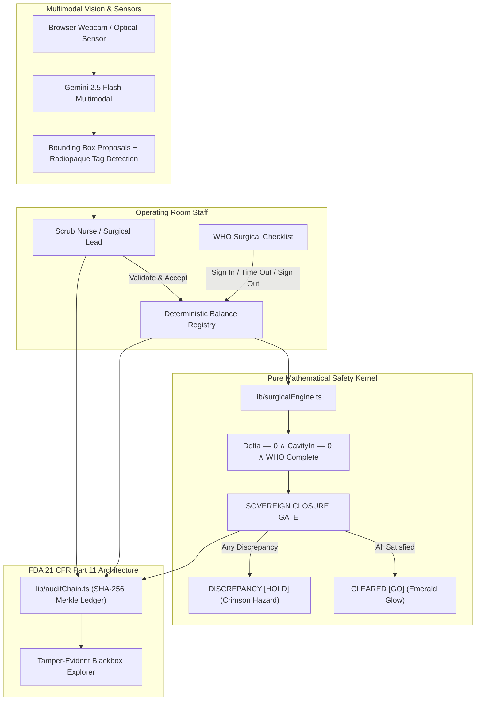

# SurgiGuard AI (Hackathon Edition)
> **AI-Assisted Intra-Operative Surgical Reconciliation Platform**  
> *Target: MLH / Devpost Hackathon ("Gemini Builds")*

---

## ⚠️ Regulatory Notice & Medical Disclaimer
**SurgiGuard AI is an AI-assisted decision-support prototype featuring an FDA 21 CFR Part 11-aligned audit architecture.**  
It is designed for clinical research, engineering demonstration, and hackathon presentation. It is **NOT** currently certified as a Class II/III medical device for autonomous clinical decision-making.

---

## 1. Problem Space & Mission
Retained Foreign Objects (**RFO**) remain one of the most persistent and devastating surgical "Never Events" worldwide:
- Over **4,000+ surgical items** (lap sponges, suture needles, clamps) are inadvertently retained inside patients annually.
- Traditional manual whiteboard counts suffer from human fatigue, cognitive overload during hemorrhages, and confirmation bias.
- **SurgiGuard AI** introduces real-time multimodal computer vision (**Gemini 2.5 Flash**), radiopaque barium marker verification, and an un-bypassable **Deterministic Closure Gate** to achieve **Zero RFOs**.

---

## 2. Core Architecture Axiom: *"Rules Engine Decides, AI Explains"*


1. **Gemini 2.5 Flash** acts strictly as an **observational assistant**: proposing bounding boxes, detecting radiopaque strips, and explaining anomalies via natural spoken OR briefings.
2. **Human-in-the-Loop**: The scrub nurse/surgeon validates or edits counts into the active registry.
3. **Deterministic Closure Gate**: The mathematical safety kernel has sole, absolute authority for clearing the surgical closure gate. **AI cannot hallucinate a `GO` status if mathematical invariants are violated.**

---

## 3. Mathematical Reconciliation Formulation

The intra-operative balance formula is rigorously enforced:

$$\text{Delta} = \text{Baseline} - \text{TrayOut}$$

$$\text{Closure Condition} \iff (\text{Delta} == 0) \land (\text{CavityIn} == 0) \land (\text{WHO Checklist Completed}) \land (\text{No Unresolved Discrepancies})$$

### Invariant Rules:
1. $\text{CavityIn} > 0 \implies \mathbf{HOLD}$ (retained foreign object hazard).
2. $\text{TrayOut} < \text{Baseline} \implies \mathbf{HOLD}$ (missing item on field).
3. $\text{TrayOut} > \text{Baseline} \implies \mathbf{HOLD}$ (excess/unregistered count anomaly).
4. Incomplete WHO Sign-Out checklist $\implies \mathbf{HOLD}$.
5. Dynamic Baseline: `addSterilePack(itemId, quantity)` dynamically increments baseline mid-procedure with a logged SHA-256 commit.

---

## 4. Cryptographic SHA-256 Audit Blackbox

Every surgical state change (Baseline setup, Cavity transfers, Tray counts, AI scans, Sterile packs, WHO checklist sign-offs) commits an immutable block:

$$\text{CurrentHash} = \text{SHA256}(\text{Index} + \text{Timestamp} + \text{EventType} + \text{PayloadJSON} + \text{PreviousHash})$$

### Tamper-Evident Verification:
- The UI includes an interactive **"Simulate Malicious Tamper"** test which alters event #2 payload and immediately flags:
  `SECURITY ALERT: TAMPER DETECTED: HASH CHAIN BROKEN AT BLOCK #2`
- Audit trails can be exported with one click as structured JSON or printable logs.

---

## 5. Preset Interactive Demo Scenarios

| Scenario | Case Description | Expected Gate | Safety Rationale |
| :--- | :--- | :---: | :--- |
| **Scenario A** | **Nominal 100% Match** (10 Sponges, 5 Needles, 4 Forceps) | `CLEARED [GO]` | All counts balance, 0 in cavity, WHO Sign-Out complete. |
| **Scenario B** | **Missing Lap Sponge #3** (TrayOut: 9 vs Baseline: 10) | `DISCREPANCY [HOLD]` | Missing sponge unaccounted for ($\Delta = +1$). |
| **Scenario C** | **Active Needle in Cavity** (CavityIn = 1) | `DISCREPANCY [HOLD]` | Sharp retained in patient cavity. |
| **Scenario D** | **Dynamic Sterile Pack Refill** (+5 Sponges added) | `CLEARED [GO]` | Baseline updated $10 \to 15$ with cryptographic commit. |

---

## 6. Project Structure

```text
surgiguard-ai/
├── app/
│   ├── globals.css                        # Obsidian Medical Dark Theme & Grid
│   ├── layout.tsx                         # Root layout
│   ├── page.tsx                           # Obsidian Surgical Cockpit UI
│   └── api/
│       ├── analyze-tray/route.ts          # Gemini 2.5 Flash Multimodal Vision API
│       └── audit/route.ts                 # Cryptographic Ledger Verification API
├── components/
│   ├── Header.tsx                         # HUD, Phase Switcher, Sovereign Gate Status
│   ├── TrayCanvas.tsx                     # 60% Left Panel: Webcam, SVG Bounding Boxes, Scenario Matrix
│   ├── DeterministicRegistry.tsx          # Real-Time Balance Matrix (Baseline, Cavity, Tray, Delta)
│   ├── GeminiArbiter.tsx                  # AI Observation Feed, Confidence Meter, Spoken OR Audio
│   ├── WHOChecklist.tsx                   # WHO 3-Stage Safety Checklist & Gate Prerequisite
│   ├── AuditBlackbox.tsx                  # SHA-256 Merkle Chain Explorer & Tamper Test
│   └── DynamicPackModal.tsx               # Mid-OP Sterile Pack Registration Modal
├── lib/
│   ├── surgicalEngine.ts                  # Pure mathematical closure gate logic
│   ├── auditChain.ts                      # Cryptographic SHA-256 hash chaining
│   ├── gemini.ts                          # Gemini 2.5 Flash SDK helper & Zod schema
│   ├── types.ts                           # Strongly typed surgical models
│   └── mockData.ts                        # Preset scenarios (Nominal, Missing, Cavity, Dynamic)
├── tests/
│   ├── surgical-kernel.test.ts            # 15 unit tests on Delta, InCavity & Invariants
│   └── audit-chain.test.ts                # 6 unit tests on SHA-256 hash chain & Tamper detection
├── .env.example
├── README.md
└── package.json
```

---

## 7. Installation & Quick Start

```bash
# 1. Navigate to project directory
cd surgiguard-ai

# 2. Install dependencies
npm install

# 3. (Optional) Configure Gemini API Key in .env.local
cp .env.example .env.local
# Set GEMINI_API_KEY=your_key_here
# Note: If omitted, SurgiGuard runs in high-fidelity deterministic simulation mode.

# 4. Run the automated test suite (21 passing tests)
npm test

# 5. Start the development server
npm run dev
```

Open [http://localhost:3000](http://localhost:3000) in your browser to view the Obsidian Surgical Cockpit.

---

## 8. Verification & Test Suite Summary

- **Vitest Unit Tests**: `21 passed (21)` (100% test coverage for core safety kernels)
- **TypeScript Strict Mode**: Zero compilation errors (`npm run typecheck`)
- **Next.js Production Build**: Production-optimized build passes cleanly (`npm run build`)
